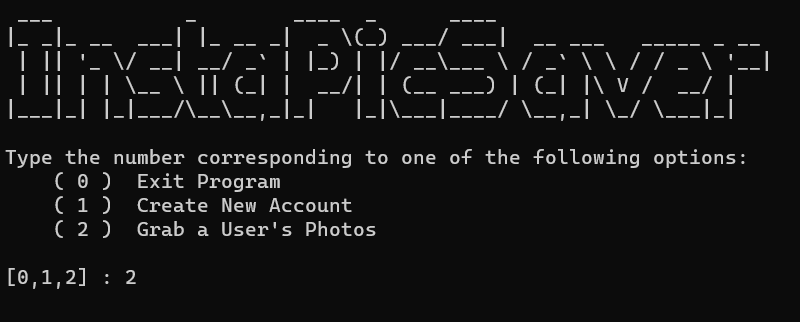
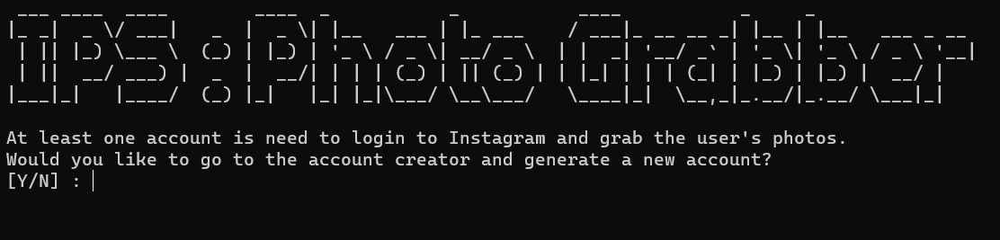
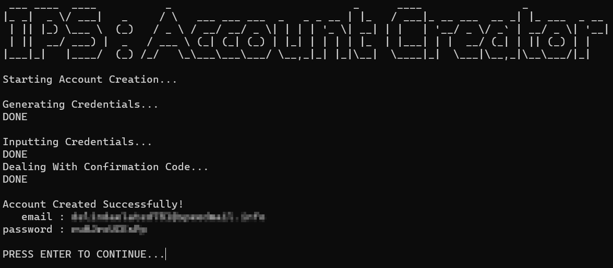
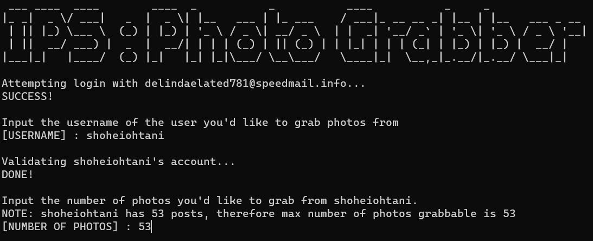
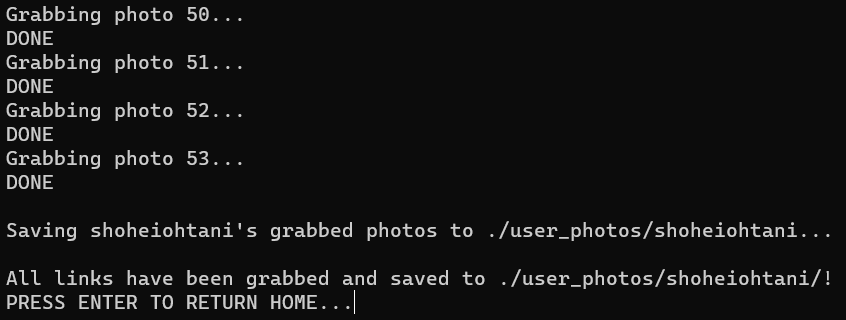

# insta-pic-saver

## What is InstaPicSaver?
InstaPicSaver is a program that allows you to scrape photos from PUBLIC Instagram profiles. This is done through logging in with a bot account created through another Python script I wrote and the selenium module!

## Requirements
Requirements can be found in requirements.txt, all of the libraries needed do not require any specific versions to work! 

## Walkthrough
The program is pretty intuitive to use and requires needing only the account's username that you want to get your photos from to use. The following is an in-depth walkthrough of how to use the program:

### Step 1: Enter a valid command
Upon starting the program, and the webdriver starts up, you will be greeted with a command line GUI:

In this case, we will select Option 2, "Grab a User's Photos" you can also input 1 to create a new Instagram bot account (you need at least one to grab photos), or input 0 to exit the progam.

### Step 2: Handle account creation
Once you input 2, you will then be taken to IPS: Photo Grabber, on startup the photograbber will attempt to login to all previously created Instagram bot accounts, found in ./ig_bot_creator/plain_accounts.txt, until one of them works. Upon installation, this file will be empty and you will encounter a prompt such as this:

Note: you can say no to this prompt, however, if you reply no you will simply be sent back to the home page since you NEED an account to continue with the Photo Grabber. Once you agree to the prompt you will be sent to the IPS: Account Creator. In which you will be prompted again to confirm you the account generation, when you do, the generation will start and you won't need to do anything but watch the progress.
Note: During account creation, if the program hangs while "dealing with the confirmation code", this is normal as this part takes the longest out of the entire process

This is what a successful account creation, the email and password generated can be found in ./ig_bot_creator/plain_accounts.txt. However, if you simply need to grab photos, you shouldn't need to put in any login credentials manually. 

### Step 3: Inputting account's username and number of photos to grab
After you press ENTER to continue, you will be sent back to the Photo Grabber and an attempt to login to the newly created account will begin automatically. Once the attempt succeeds, you can now input the username of the Instagram account you want to grab photos from as well as the number of photos you'd like to grab:
Note: After you input the username of the account and then press ENTER, the program will validate the account making sure: the acocunt exists, the account has posts, and the account isn't private.

Here I'm using baseball star, Shohei Ohtani's Instagram account, and I want to grab 53 photos from his account
Note: The program tells you the max amount of photos you can grab from the user automatically, if you attempt to go over, it will only grab the max amount.
Once you press enter, the program will start to grab all the links of the number of photos you specified and then save them to ./user_photos/[USERNAME]:

And with that you can return home and start the process all over again!
